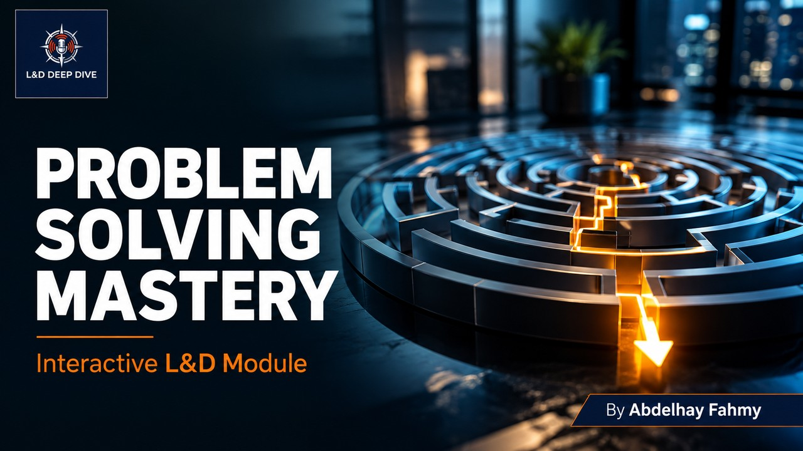

# Problem Solving Mastery: Strategic Thinking & Decision Making

**An Interactive Corporate Learning & Development Module**
*Developed by Abdelhay Fahmy | L&D Consultant*

## 📌 Project Overview
The **Problem Solving Mastery** module is an immersive, browser-based corporate training presentation. Designed to elevate critical thinking and strategic decision-making, it moves beyond static slides by offering interactive scenarios, real-time assessments, and practical methodologies. This project serves as a showcase of modern instructional design, blending gamified learning with seamless back-end data tracking.

## 🎯 Key Learning Objectives
By completing this module, professionals will be able to:
* **Define the Core Issue:** Accurately separate symptoms from root causes in complex business environments.
* **Analyze Strategically:** Apply proven frameworks (such as the 5 Whys and Fishbone diagrams) for deep Root Cause Analysis (RCA).
* **Develop Solutions:** Brainstorm, evaluate, and prioritize strategic solutions based on impact and feasibility.
* **Execute & Monitor:** Implement structured action plans and establish metrics to measure success and prevent recurrence.

## 🚀 Technical Features & Innovations
* **Interactive Simulations:** Scenario-based challenges that require learners to apply problem-solving frameworks before progressing.
* **Real-Time Assessment & Feedback:** Built-in evaluations that measure knowledge retention instantly, ensuring learning objectives are met.
* **Automated L&D Data Tracking:** 
  * A seamless front-end data capture system.
  * Back-end integration via **Google Apps Script** to automatically transmit completion rates, scores, and learner insights directly to a Google Sheet.
* **Responsive Corporate UI:** A sleek, distraction-free interface utilizing HTML/CSS/JavaScript with glassmorphism aesthetics and dynamic animations, reflecting the premium *L&D Deep Dive* brand identity.

## 🛠️ Built With
* **HTML5 / CSS3 / Vanilla JavaScript**
* **FontAwesome** (Icons)
* **Google Fonts** (Poppins)
* **Google Apps Script API** (For data collection and L&D reporting)

---
*For inquiries regarding instructional design, corporate training modules, or strategic L&D consultation, please connect via [LinkedIn](https://www.linkedin.com/in/abdelhayfahmy) or visit the [L&D Deep Dive Page](https://www.linkedin.com/company/110834128/admin/).*
